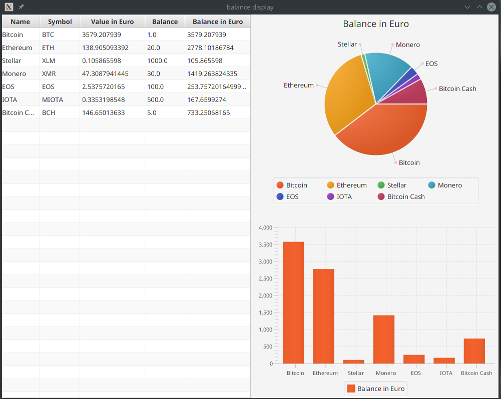

balance display
====================================

This is a simple kotlin program to display the balance of your crypto currencies 
and the value of your tokens in Euros or Dollars.




How it works
--------

This is a simple program written in kotlin using tornadofx.

To make the program work, the user must specify the name and number of his coins in the "input.txt" file.
With this information, the program calculates the user's balance using the website https://www.coingecko.com/.

As build management automation tool gradle is used in this project.


Installation
--------
You can download a ready-to-use project folder from https://github.com/mec-kon/balance-display/releases.
This only needs to be unzipped.
To start the program just double click on the .jar file or enter ```java -jar BalanceDisplay-1.1-SNAPSHOT.jar``` in the terminal.

A java installation is required for the program to work.

Pull requests
--------

Pull requests are always welcome !


Donations
--------
If this project helps you, you can give me a cup of coffee :)

* Bitcoin <br>
  1LFRHmdxpNNu9N544nAnPZ4VovrEuLUG8M
 
* Ethereum <br>
  0x728ec1a37551E55e6127a34eE88E36Ca1BfB6f46


* Monero <br>
4APzJpJh4z7RpxwYSfN1rYWeUYWvqRZjA2VDAmvm52quXtMr3XcdcZNSwinRBFQ2MZRBdUhSCiGgfPUv7WUpBmVT3a1zYA3
